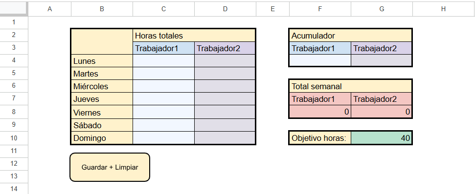
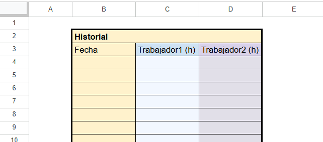

# 📊 Documento de Google Sheets para el seguimiento de horas de trabajo.
## 📸 Vista Previa
<table border="0">
  <tr>
    <td width="50%"></td>
    <td width="50%"></td>
  </tr>
</table>

---

## 🎯 Motivación
Este proyecto nació como un proyecto personal con el objetivo de poder contabilizar mis horas trabajadas semana a semana y cumplir mis objetivos marcados. Se podría hacer con una tabla básica, sin necesidad de Apps Script, pero preferí hacerlo así por mi devoción por la automatización de procesos. De esta forma, solamente añadiendo horas a una celda queda todo organizado automáticamente.

---

## 💡 Posibles Aplicaciones
La aplicación mas clara es la comentada anteriormente, contabilizar horas de trabajo, pero realmente se puede utilizar para muchas cosas. Sobre todo es útil para cosas que sean acumulativas como por ejemplo contar el número de comidas que haces cada día, el número de veces que realizas cierta actividad etc.
Además, el proyecto cuenta con espacio para dos trabajadores pero podría ponerse la cantidad deseada haciendo ajustes en el código. En lugar de dos personas, podría pensarse también como una persona y dos tareas distintas que se quieren contabilizar por separado.

---

## 📖 Modo de Uso
La hoja tiene 3 funciones principales.
1. La celda de "Acumulador": hay una por cada trabajador, esa será la única celda (junto con la del objetivo) que se modifica manualmente, cada vez que el trabajador haga horas (o en general cada vez que se quiera contabilizar algo) se pone el número, sin unidades, en dicha casilla. Google sheets se encargará automáticamente de sumar esas horas a las añadidas previamente y limpiar esa casilla para volver a añadir más la próxima vez. Además, las horas se sumarán automáticamente en el día de la semana en el que estemos. De esta forma, las horas se añaden manualmente en la misma celda independientemente del día y será Google sheets quien e encargue de clasificarlas.
2. El "Total semanal": la hoja de cálculo sumará las horas de lo que va de semana de cada trabajador y de esta forma se puede ver el ritmo de progreso. Esta casilla será de color rojo si el número de horas totales es menor que el objetivo fijado y será de color verde si es igual o mayor que el objetivo.
3. El botón de "Guardar + Limpiar": este botón está pensado para ser pulsado al inicio de cada semana. Al pulsarlo, el total de horas de esa semana se guardará en la primera fila vacía de la tabla de "Historial" junto con la fecha del momento, un instante después se borrará el contenido de la tabla de los días de la semana para dar paso al registro de una nueva semana. Otra opción sería programar esta acción de forma automática al inicio de cada semana sin necesidad de pulsar un botón, en mi caso preferí el botón para tener algo más de control.

### Funciones Automatizadas (Script)
* **`principal.gs`:** el código detrás del acumulador y la clasificación por días.
* **`historial.gs`:** el código detrás del guardado tras pulsar el botón.

---

## 🚀 Cómo Acceder a la Plantilla

Para probar la herramienta con total funcionalidad en tu propio Google Drive:

1. Haz clic en el siguiente enlace de copia directa:  
   👉 **[🔗 Abrir Plantilla en Google Sheets](https://docs.google.com/spreadsheets/d/1bl8XL_i6fNlVJf_YfsRXabvgmlrYfvfDsM_j89-atd4/copy)**
2. Presiona el botón azul **"Hacer una copia"**.
3. La hoja se guardará automáticamente en tu Google Drive con permisos totales de edición.

> ⚠️ **Nota sobre los permisos de Apps Script:**  
> La primera vez que ejecutes el botón de Guardar+Limpiar, Google te pedirá autorizar los permisos de ejecución. Esto es una medida de seguridad estándar al usar código personalizado en tu propia cuenta.

---

## 🛠️ Herramientas y Tecnologías Utilizadas

* **[Google Sheets](https://www.google.com/sheets/about/):** Diseño de interfaz, estructura de datos y fórmulas avanzadas.
* **[Google Apps Script](https://developers.google.com/apps-script):** Automatización de procesos en el entorno de Google Workspace (código ubicado en `principal.gs` y `historial.gs`).

---

## 🖥️ Estructura del Repositorio

```text
├── README.md        # Presentación del proyecto
├── historial.gs        # Código fuente de Google Apps Script
├── principal.gs        # Código fuente de Google Apps Script
├── vista_previa_acumulador.png    # Captura de pantalla de la interfaz
└── vista_previa_hsitorial.png    # Captura de pantalla de la interfaz
